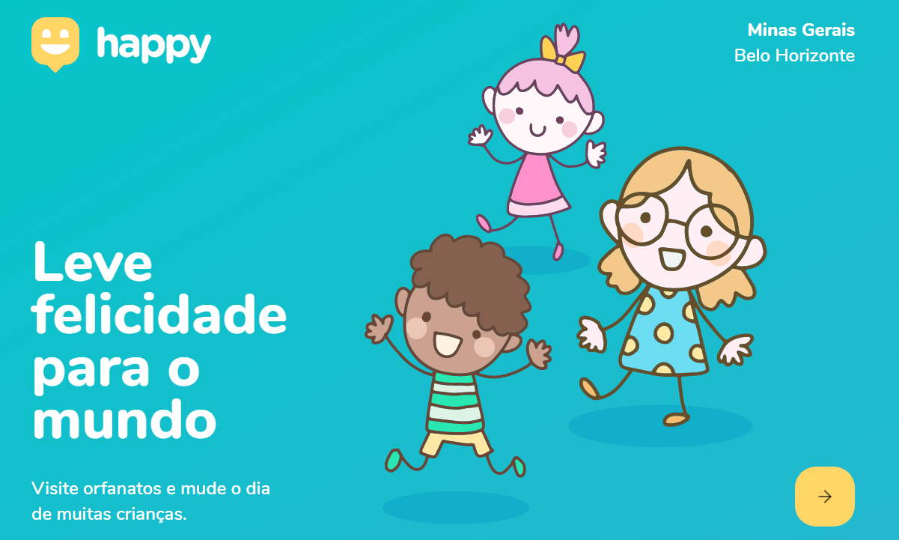
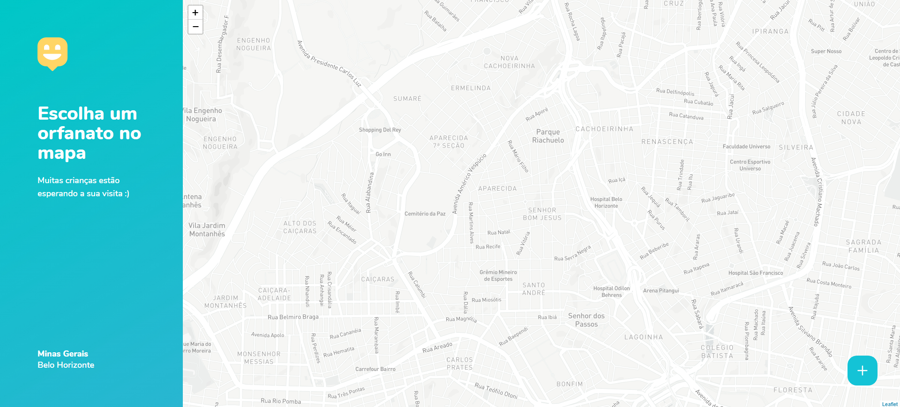
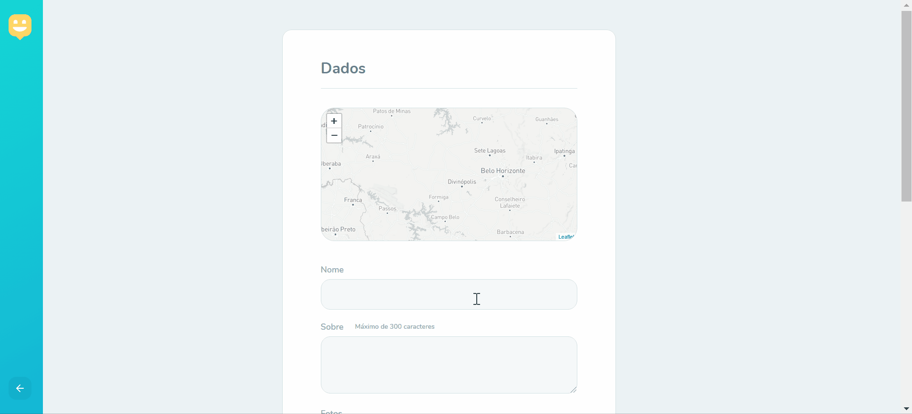

  

  

  
   

<h4 align="center"> 
	🚧  Happy 🧍‍♀️🧍‍♂️ Concluído 🚀 🚧
</h4>

 <a href="#-sobre-o-projeto">Sobre</a> •
 <a href="#-funcionalidades">Funcionalidades</a> •
 <a href="#-layout">Layout</a> • 
 <a href="#-como-executar-o-projeto">Como executar</a> • 
 <a href="#-tecnologias">Tecnologias</a> • 
 <a href="#-autor">Autor</a> • 
 <a href="#user-content--licença">Licença</a>

## 💻 Sobre o projeto

🧍‍♀️🧍‍♂️ Happy - é um projeto que une orfanatos e pessoas que desejam visitar ou adotar uma criança.

Projeto desenvolvido durante a **NLW - Next Level Week** oferecida pela [Rocketseat](https://blog.rocketseat.com.br/primeira-next-level-week/).
O NLW é uma experiência online com muito conteúdo prático, desafios e hacks onde o conteúdo fica disponível durante uma semana.

---

## ⚙️Funcionalidades
- [x] Pessoas físicas podem fazer buscas na plataforma
- [x] Instituições de Orfanatos podem se cadastras na plataforma
- [x] nome da entidade, sobre, instruções, fotos, horario de funcionamento e se funciona final de semana
- [x] e o endereço para que ele possa aparecer no mapa

---

## 🎨 Layout

O layout da aplicação está disponível no Figma:

### Website

